<!-- Assets in /assets are regenerated daily by .github/workflows/build.yml — edit tools.json, not the SVGs. -->

  
  
  

 

<!-- tools:start -->

  
  

<!-- tools:end -->

 

 

 

<!-- stack:start -->

<!-- stack:end -->

 

