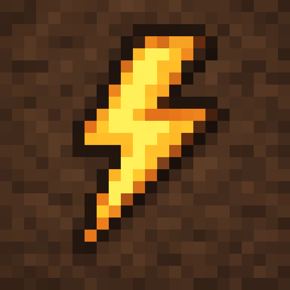
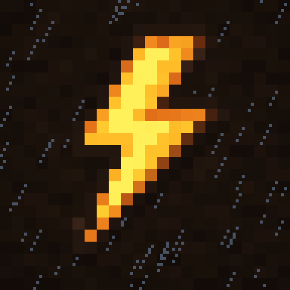
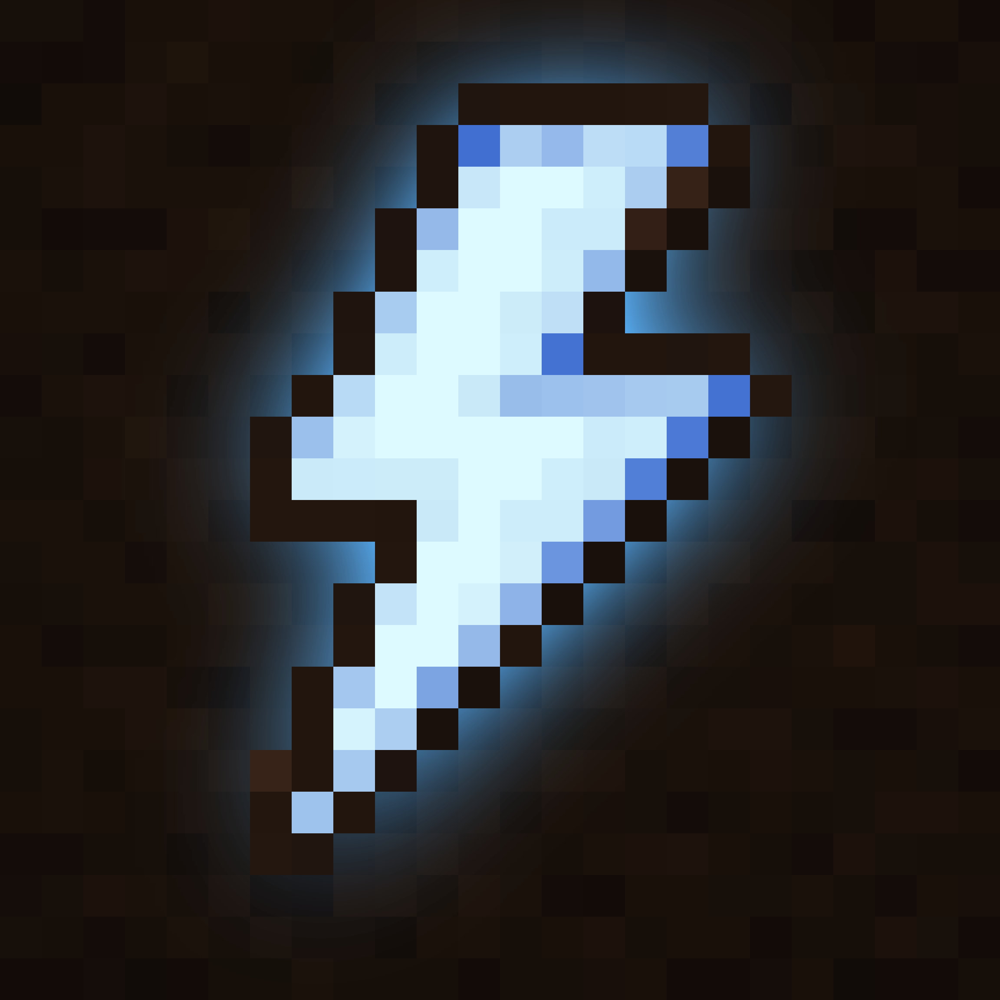

<h1 align="center">⚡ Liam+ Lightning PFP pack</h1>

The original 24×24 lightning block, remastered pixel-for-pixel and animated. 
<b>WebP</b> = full quality 1152px (transparency where named) · <b>GIF</b> = 576px, works everywhere (Discord, etc.) · <b>APNG</b> = 576px transparent. 
Stills are 2304px PNG (plus 512px versions of 01 and 05).

## Animated

<table>
<tr><td align="center" width="33%"> <b>01</b> glow pulse [WebP](animated/webp/01-glow-pulse.webp) 486 KB · [GIF](animated/gif/01-glow-pulse.gif) 2.1 MB</td><td align="center" width="33%"> <b>02</b> glow pulse black [WebP](animated/webp/02-glow-pulse-black.webp) 471 KB · [GIF](animated/gif/02-glow-pulse-black.gif) 2.2 MB</td><td align="center" width="33%"> <b>03</b> glow pulse transparent [WebP](animated/webp/03-glow-pulse-transparent.webp) 1.8 MB · [APNG](animated/apng/03-glow-pulse-transparent.png) 3.7 MB</td></tr>
<tr><td align="center" width="33%"> <b>04</b> fade in out [WebP](animated/webp/04-fade-in-out.webp) 336 KB · [GIF](animated/gif/04-fade-in-out.gif) 2.0 MB · [APNG](animated/apng/04-fade-in-out.png) 2.4 MB</td><td align="center" width="33%"> <b>05</b> fade in out transparent [WebP](animated/webp/05-fade-in-out-transparent.webp) 1007 KB · [APNG](animated/apng/05-fade-in-out-transparent.png) 2.9 MB</td><td align="center" width="33%"> <b>06</b> lightning strike [WebP](animated/webp/06-lightning-strike.webp) 381 KB · [GIF](animated/gif/06-lightning-strike.gif) 1.6 MB</td></tr>
<tr><td align="center" width="33%"> <b>07</b> lightning strike black [WebP](animated/webp/07-lightning-strike-black.webp) 340 KB · [GIF](animated/gif/07-lightning-strike-black.gif) 1.4 MB</td><td align="center" width="33%"> <b>08</b> storm night [WebP](animated/webp/08-storm-night.webp) 640 KB · [GIF](animated/gif/08-storm-night.gif) 2.2 MB</td><td align="center" width="33%"> <b>09</b> electric arcs [WebP](animated/webp/09-electric-arcs.webp) 493 KB · [GIF](animated/gif/09-electric-arcs.gif) 1.7 MB</td></tr>
<tr><td align="center" width="33%"> <b>10</b> electric arcs transparent [WebP](animated/webp/10-electric-arcs-transparent.webp) 1.8 MB · [APNG](animated/apng/10-electric-arcs-transparent.png) 3.2 MB</td><td align="center" width="33%"> <b>11</b> charge up [WebP](animated/webp/11-charge-up.webp) 490 KB · [GIF](animated/gif/11-charge-up.gif) 2.4 MB</td><td align="center" width="33%"> <b>12</b> charge up black [WebP](animated/webp/12-charge-up-black.webp) 472 KB · [GIF](animated/gif/12-charge-up-black.gif) 2.3 MB</td></tr>
<tr><td align="center" width="33%"> <b>13</b> pixel assemble [WebP](animated/webp/13-pixel-assemble.webp) 384 KB · [GIF](animated/gif/13-pixel-assemble.gif) 1.7 MB · [APNG](animated/apng/13-pixel-assemble.png) 2.2 MB</td><td align="center" width="33%"> <b>14</b> glitch [WebP](animated/webp/14-glitch.webp) 332 KB · [GIF](animated/gif/14-glitch.gif) 1.4 MB</td><td align="center" width="33%"> <b>15</b> item spin [WebP](animated/webp/15-item-spin.webp) 749 KB · [GIF](animated/gif/15-item-spin.gif) 2.3 MB · [APNG](animated/apng/15-item-spin.png) 3.7 MB</td></tr>
<tr><td align="center" width="33%"> <b>16</b> item spin transparent [WebP](animated/webp/16-item-spin-transparent.webp) 2.0 MB · [APNG](animated/apng/16-item-spin-transparent.png) 3.3 MB</td><td align="center" width="33%"> <b>17</b> overcharge blue [WebP](animated/webp/17-overcharge-blue.webp) 523 KB · [GIF](animated/gif/17-overcharge-blue.gif) 2.3 MB</td><td align="center" width="33%"> <b>18</b> overcharge blue transparent [WebP](animated/webp/18-overcharge-blue-transparent.webp) 2.0 MB · [APNG](animated/apng/18-overcharge-blue-transparent.png) 4.4 MB</td></tr>
</table>

## Stills

<table>
<tr><td align="center" width="33%"> 01-remastered-2304.png · 28 KB</td><td align="center" width="33%"> 02-bolt-transparent-2304.png · 25 KB</td><td align="center" width="33%"> 03-bolt-glow-transparent-2304.png · 192 KB</td></tr>
<tr><td align="center" width="33%"> 04-bolt-glow-black-2304.png · 237 KB</td><td align="center" width="33%"> 05-glow-on-dirt-2304.png · 222 KB</td><td align="center" width="33%"> 06-night-2304.png · 246 KB</td></tr>
<tr><td align="center" width="33%"> 07-overcharged-blue-2304.png · 245 KB</td></tr>
</table>

Download everything: <a href="https://github.com/Jestriker/Jestriker/archive/refs/heads/main.zip">repo zip</a> → <code>pfp/</code> · local preview: open <code>gallery.html</code>

